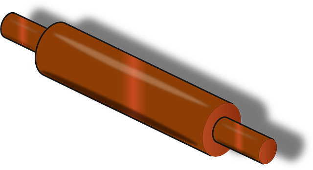
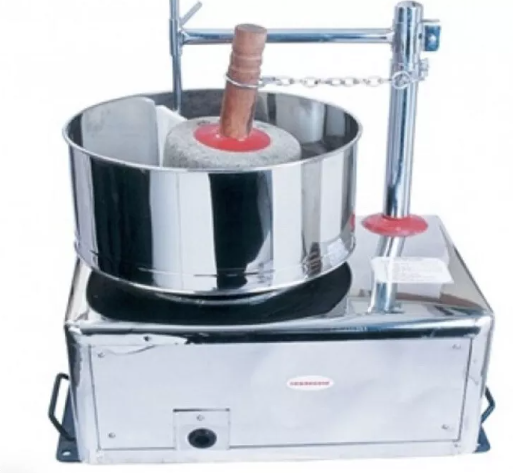
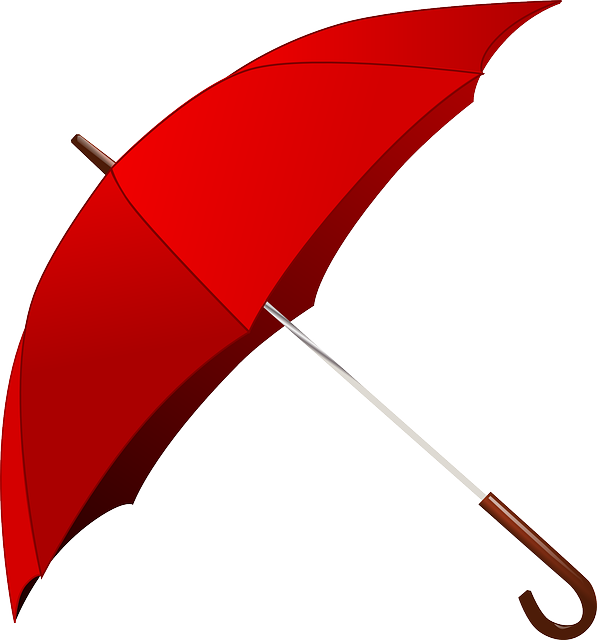

**भवतः/भवत्या: नाम किम्? _____**  

**शुद्धं वा(&check;)? अशुद्धं वा?(&cross;)**  
१. स: राम:  
२. सा सीता  
३. तत् करदीप:  
४. तत् फलम्   
५. सा हस्तघटी   
६. तत् वृक्ष:  
७. सा नलिनी 

**प्रश्न: क:**  
१. सा द्रोणी  
२. सा रमा   
३. स: गणेश:  
४. स: चमस:  
५. तत् पर्णम्  

**उदाहरणं दृष्ट्वा वाक्यानी लिखतु(स:, सा, तत्)**  
१.    - **स: वृक्ष:**   
२.  (दर्पण:)  
३.  (घट:)  
४.  (पाण्चालीका)  
५.  (चषकाधानी - saucer)  
६.  (वेल्लनी)  
७.  (पेषकम्)  
८.  (कार्-यानम्)  
९.  (छत्रम्)