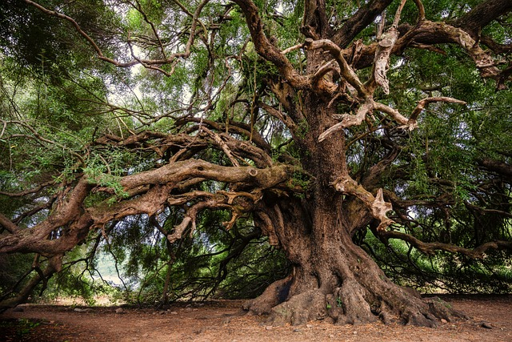
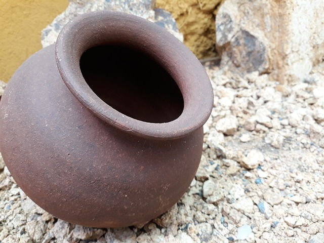

**भवतः/भवत्या: नाम किम्? _____**  

**शुद्धं वा(&check;)? अशुद्धं वा?(&cross;)**  
1. स: राम:  
2. सा सीता  
3. तत् करदीप:  
4. तत् फलम् 
5. सा हस्तघटी 
6. तत् वृक्ष:
7. सा नलिनी 

**प्रश्न: क:**
1. सा द्रोणी
2. सा रमा 
3. स: गणेश:
4. स: चमस:
5. तत् पर्णम्

**उदाहरणं दृष्ट्वा वाक्यानी लिखतु(स:, सा, तत्)**  
   - स: वृक्ष:   
 (दर्पण:)  
 (घट:)
