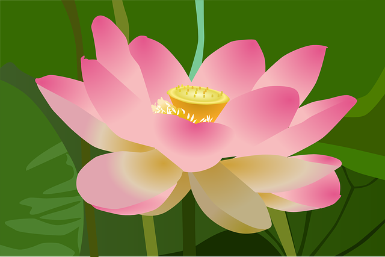
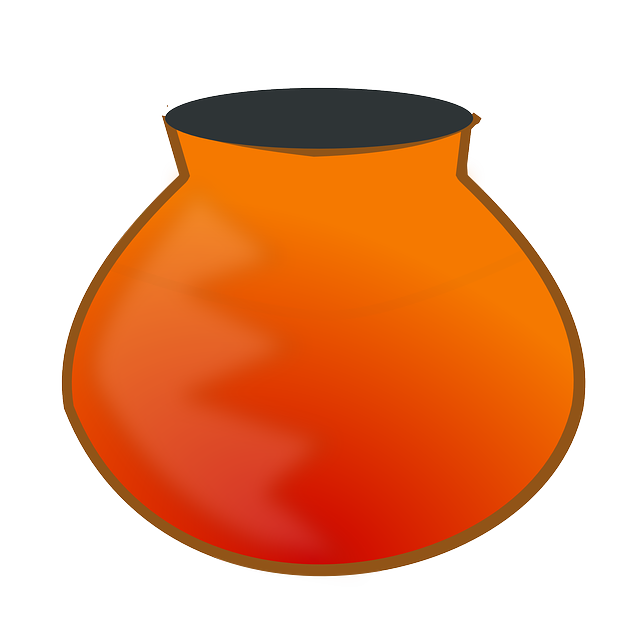
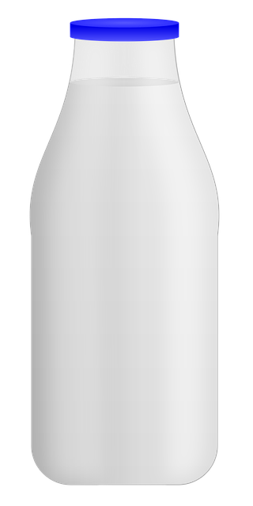

एकवचनम् | बहुवचनम् किम्? |
|----|----|
चषक: अस्ति | ? |
माला अस्ति | ? |
कूपी अस्ति | ? |
पुष्पम् अस्ति | ? |
भवान् गायक: अस्ति | ? |
भवती नर्तकी अस्ति | ? |
अहं छात्रा अस्मि | ? |

१.  
     &emsp;   
     &emsp;   
     &emsp;  

२.  
 

३.  
 

४.  

५.  

६.  
  

७.   

८.  
  

९.  

१०. 

११. 
