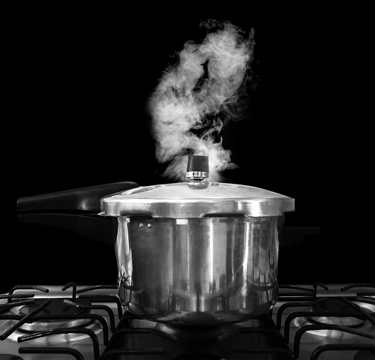

**भवतः/भवत्या: नाम किम्? _____**
**अहं  _____**  

**शुद्धं वा(&check;)? अशुद्धं वा?(&cross;)**  
१. एषा सेविका  
२. एषा सीता  
३. एष: चषक:  
४. एतत् फलम्   
५. एतत् अग्निपेटिका   
६. एष: पात्रम्  
७. एतत् दन्तकूर्च: 

**प्रश्न: क:**  
१. एषा वैद्या  
२. एषा छुरिका   
३. एष: चमस:  
४. एष: गणेश:  
५. एतत् पर्णम्  

**उदाहरणं दृष्ट्वा वाक्यानी वदतु (एष:, एषा, एतत्)**  
१.    - **एष: आपण:(store)**   
२.  (अग्निपेटिका)  
३.  (बाष्पस्थली)  
४.  (भगिनी వేరొక స్త్రీ ని పిలవడానికి ఉపయోగించే పదం)  
५.  (कार्यालय:)  
६.  (सिक्थवर्तिका)  
७.  (सोपानम् - మెట్టు)  
८.  (उद्यानम्)  
९.  (वातायनम् - కిటికి)

Picture source: dremina, pixel, pixabay