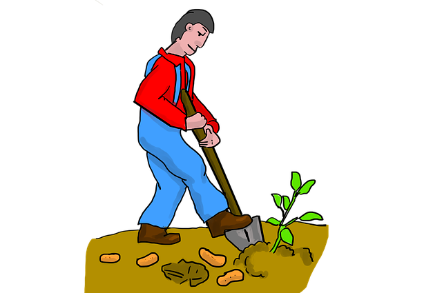

**भवतः/भवत्या: नाम किम्? _____**      
**अहं _____**  
**अहं _____**  
**अहं _____**

**भवती/भवान् का/क:? - इति प्रश्नं पृच्छतु, 
उत्तरम् अपि वदतु** 

  

**अहं का/क:? - इति प्रश्नं पृच्छतु, 
उत्तरम् अपि वदतु** 

  

 

Picture source: pixabay