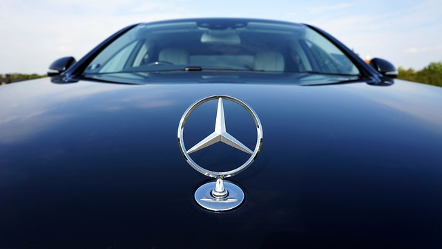

### उदाहरणं दृष्ट्वा उत्तरं वदतु |

**वैध्या - वैध्याया:**  
**युवती - युवत्या:**  
**गौरी - गौर्या:**  
**राम: - रामस्य**   

**वाटिका - ?**   
**पाठशाला - ?**  
**भोजनशाला - ?**   
**सुशीला - ?**   
**गङ्गा - ?**  
**काशी - ?**  
**नदी - ?**  
**कुमारी - ?**  
**कर्तरी - ?**  
**दर्वी - ?**  
**द्रोणी - ?**  
**सरस्वती -?**  
**पार्वती - ?**  
**सूर्य: - ?**  
**चन्द्र: - ?**  
**चमस: - ?**  
**चषक: - ?**  
**दीप: - ?**  
**कङ्कतम् - ?**  
**वातायनम् - ?**  
**कङ्कणम् - ?**  
**फेनकम् - ?**  
**श्वेतफलकम् - ?**  
**कन्दुकम् - ?**  
**भवनम् - ?**  
**पुस्तकम् - ?**

 
(विक्तकोश: - city bank) विक्तकोशस्य नाम City bank

  
(द्विचक्रिका - Honda)

  
(कार्-यानम् - Mercedes)

  
(कार्यलय: - microsoft)

  (पर्वत: - mount everest)

  
(आपण: - Walmart)

### पञ्च वाक्यानी लिखन्तु |
 

### प्रश्नं वदतु | उत्तरं अपि वदतु |

भवत:/ भवत्या: नाम किम्?

भवत:/भवत्या:  
&nbsp; &nbsp; &nbsp; &nbsp; &nbsp; &nbsp; (पाठशाला)  
&nbsp; &nbsp; &nbsp; &nbsp; &nbsp; &nbsp; (अम्बा)  
&nbsp; &nbsp; &nbsp; &nbsp; &nbsp; &nbsp; (लेखनी)  
&nbsp; &nbsp; &nbsp; &nbsp; &nbsp; &nbsp;(जङ्गम - दूरावाणी)  
                    नाम किम्?

भवत:/भवत्या:  
&nbsp; &nbsp; &nbsp; &nbsp; &nbsp; &nbsp; (विद्यालय:)  
&nbsp; &nbsp; &nbsp; &nbsp; &nbsp; &nbsp; (ग्राम:)  
&nbsp; &nbsp; &nbsp; &nbsp; &nbsp; &nbsp; (जनक:)  
&nbsp; &nbsp; &nbsp; &nbsp; &nbsp; &nbsp;(कार्यालय:)  
                    नाम किम्? 

### पुस्तकस्य लेखकं सम्यक् लिखतु  
|||
|----|----|
| शाकुन्तलम् | वाल्मीकि: |
| रामायणम् | भास: |
| महाभारतम् |व्यास:  |
|हर्षचरितम् | बाण: |
| कर्णभारम् | कालिदास: |
