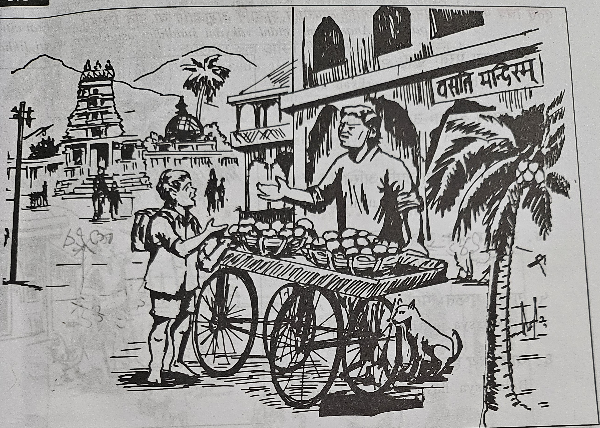

स: केशव: | - అతడు కేశవుడు.   
केशवस्य **पुरत:** शकट: अस्ति | - కేశవుని(యొక్క) ముందు బండి ఉన్నది.   
तस्य **पृष्ठत:** वसतिमन्दिरम् अस्ति | - అతని(యొక్క) వెనుక వసతి మందిరము ఉన్నది.  
तस्य **दक्षिणत:** देवालय: अस्ति | - అతని(యొక్క) కుడివైపు దేవాలయం ఉంది.  
तस्य **वामत:** वृक्ष: अस्ति | - అతని(యొక్క) ఎడమవైపు చెట్టు ఉంది.  
देवालयस्य **उपरि** कलश: अस्ति | - దేవాలయం(యొక్క) పైన కలశం ఉంది.  
शकटस्य **अध:** शुनक: अस्ति | - బండి(యొక్క) క్రింద శునకం ఉంది. 

**पुरत: - ముందు**  
**पृष्ठत: - వెనుక**  
**दक्षिणत: - కుడివైపు**  
**वामत: - ఎడమవైపు**  
**उपरि - పైన**  
**अध: - క్రింద**  