# लेखनसामग्री 

सुधाखण्ड: - సుద్ధముక్క 
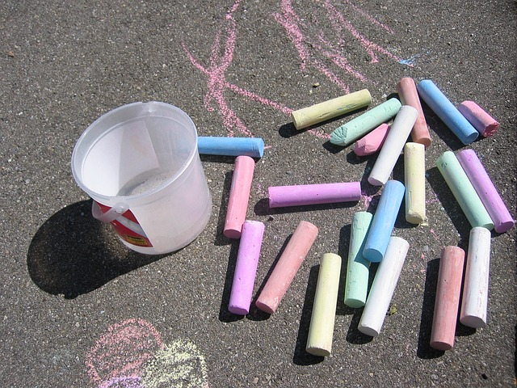    
मृदुबन्ध: - Rubber band  
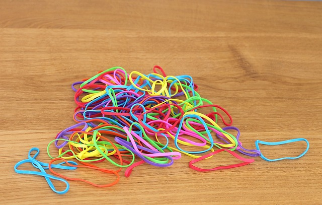   
निर्यास: - జిగురు (Gum)
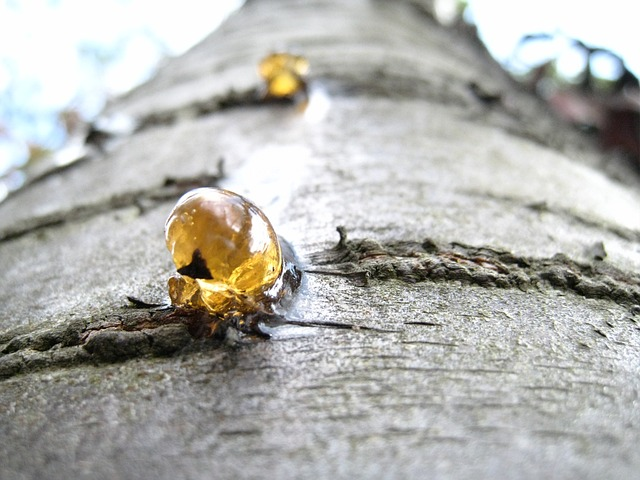  
पत्रभार: -  Paper weight
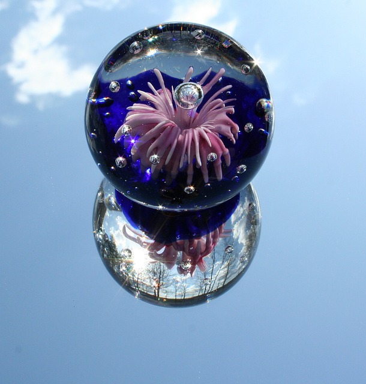  
उत्पीठिका -  బల్ల (Table)
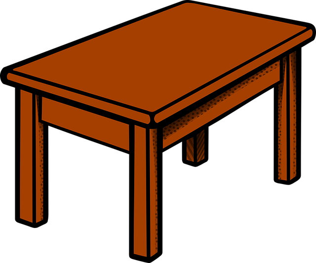   
अन्तः पेटिका -  సొరుగు (Desk/draw)   
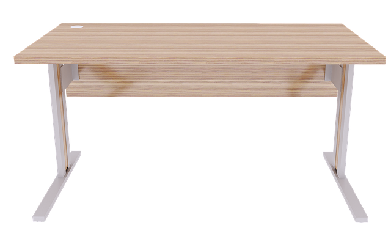    
रन्ध्रिका - punching machine   
मृदुमुद्रा - Rubber stamp
    
मापिका - Scale, కొలబద్ద
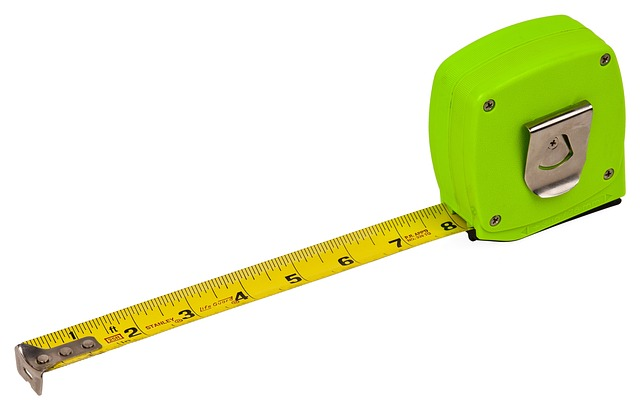   
लेपनपट्टिका - gum tape
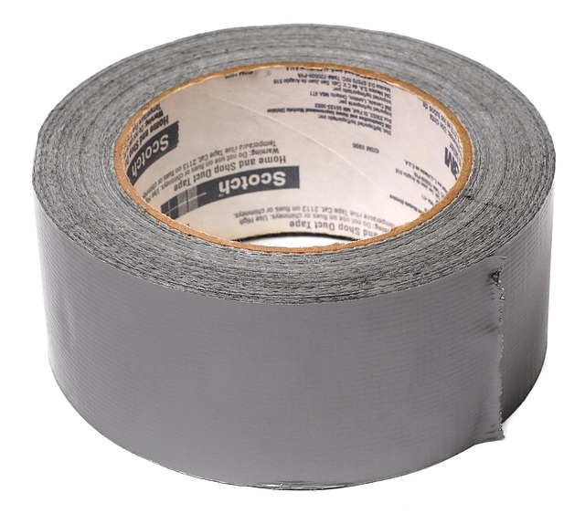   
लेखनी - కలము
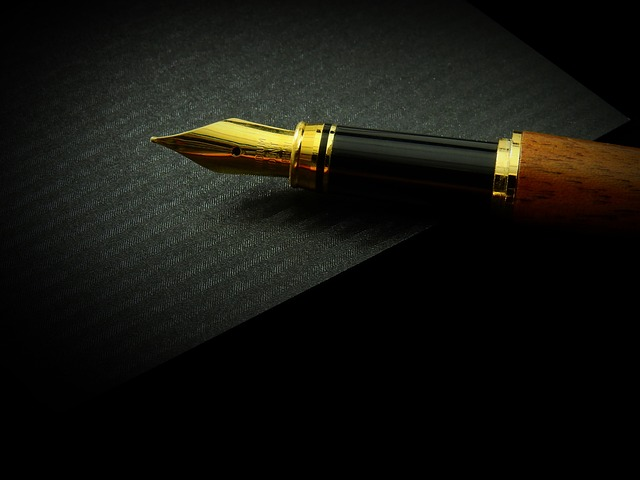  
अङ्कनी - Pencil
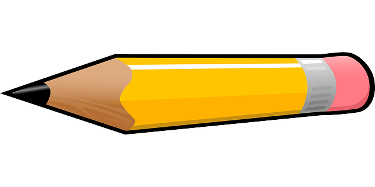    
वर्णलेखनी - Sketch pen
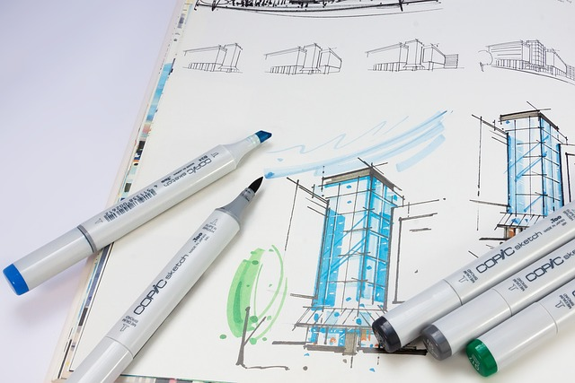   
योजनी - Stapler 
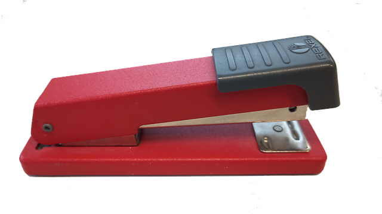  

पत्रसूची - గుండుసూది
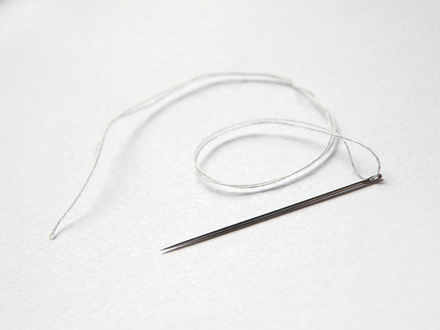  

मार्जनी - Duster
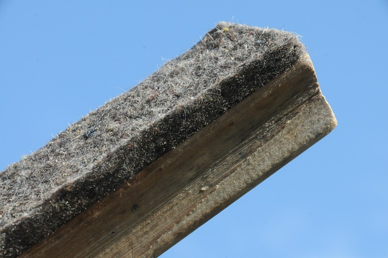   
कर्तरी - కత్తెర
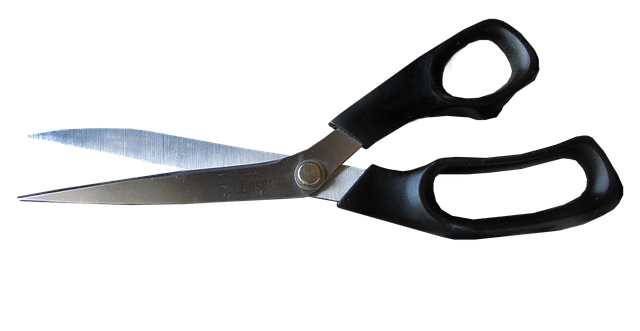    
पुस्तकम् - పుస్తకము
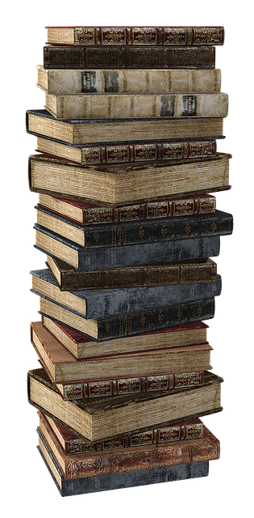    
श्वेतपत्रम् - తెల్లకాగితము
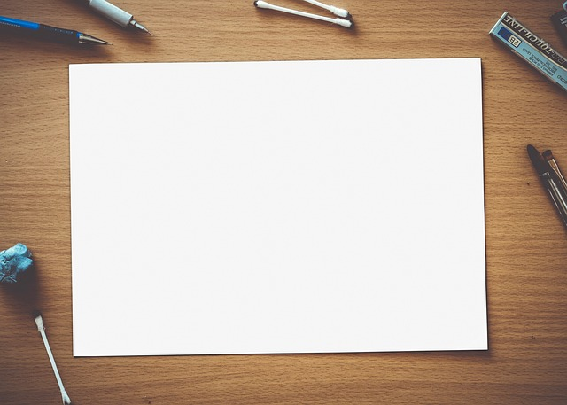    

लेखनपीठम् - వ్రాత బల్ల 
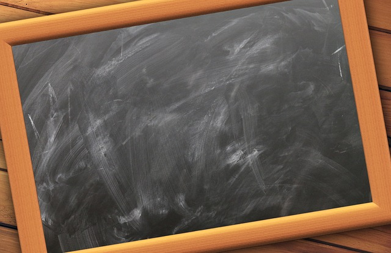  

लेखनी - Pen 
कन्दुक: - Ball
घटी - Watch 
कृष्णफलकम् - Black board    
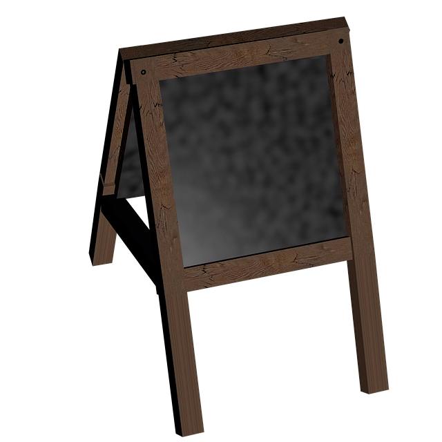  

